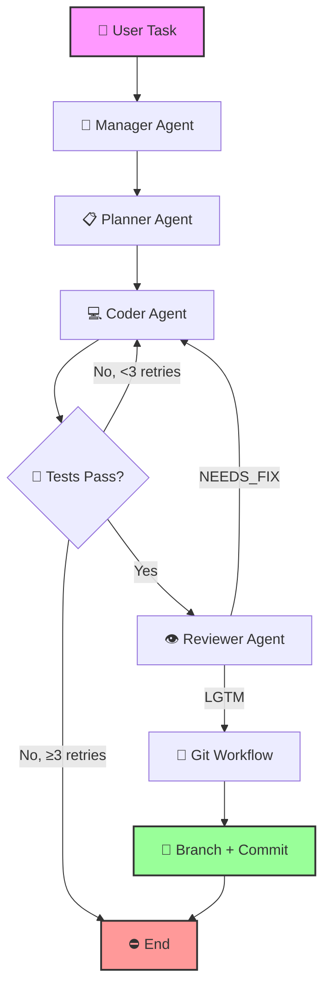

# auto-swe-agent 🤖🛠️

[](https://www.python.org/)
[](LICENSE)
[](#-swe-bench-lite-evaluation)
[](ui/app.py)
[](.github/workflows/ci.yml)
[](https://github.com/psf/black)

> An autonomous software engineering agent that reads a natural language issue, explores a codebase,
> implements the fix, runs tests, and commits the solution — all without human intervention.
> Built with LangGraph, multi-agent orchestration, Docker sandboxing, and semantic code search.

---

## 🎥 Demo

<!-- TODO: Replace with actual demo GIF once recorded -->
<!--  -->


*Real-time Streamlit UI showing agent progress, cost tracking, and circuit breaker status.*

---

## 📊 Results

| Benchmark | Score | Comparison |
|-----------|-------|------------|
| **SWE-bench Lite** | *TBD* | Early Devin: 13.86% |
| **Golden Cases** (eval/run_eval.py) | 2/2 (100%) | Custom end-to-end tests |

> Run `python -m swe_bench.run_swe_bench --num-tasks 300` to get the official score.

---

## 🏗️ Architecture



**Agent roles:**

| Agent | Model | Responsibility |
|-------|-------|----------------|
| **Manager** | flash-lite | Analyzes task complexity, produces structured plan |
| **Planner** | flash | Breaks plan into concrete implementation steps |
| **Coder** | flash | Implements code using all available tools |
| **Reviewer** | 70B | Reviews changes, outputs **LGTM** or **NEEDS_FIX** |

---

## 🚀 Quick Start

### Prerequisites

- Python 3.11+
- Docker (for sandboxed execution)
- At least one API key: [Gemini](https://aistudio.google.com/app/apikey), [Groq](https://console.groq.com/keys), or [OpenRouter](https://openrouter.ai/keys)

### Installation

```bash
git clone https://github.com/YashKasare21/auto-swe-agent.git
cd auto-swe-agent
python -m venv venv && source venv/bin/activate
pip install -r requirements.txt
```

### Run on any task

```bash
# Set your API key
export GEMINI_API_KEY=your_key_here

# Run the agent
python agent.py "The /add endpoint returns string concatenation instead of integer addition. Fix it so tests pass." --workspace ./
```

### Run with the Web UI

```bash
streamlit run ui/app.py
```

Then open `http://localhost:8501` in your browser.

### Run SWE-bench Lite evaluation

```bash
python -m swe_bench.run_swe_bench --num-tasks 10
```

---

## 🧪 Features

<details open>
<summary><strong>Multi-Agent Orchestration</strong></summary>

Four specialized agents in a pipeline — **Manager → Planner → Coder → Reviewer** — each with a different model and system prompt. The Manager analyzes complexity, the Planner creates detailed steps, the Coder implements, and the Reviewer validates before allowing a git commit.

Supports `--single-agent` flag for A/B comparison against the legacy planner-only mode.
</details>

<details open>
<summary><strong>Self-Verification Loop</strong></summary>

After every code change, the agent runs `pytest` inside the Docker sandbox. If tests fail, it goes back to the Coder with the test output as context (up to 3 retries). If they pass, the Reviewer evaluates before committing.
</details>

<details open>
<summary><strong>Semantic Code Search (RAG)</strong></summary>

AST-based code chunker → sentence-transformers embeddings → FAISS vector index. The agent can search for code by **meaning**, not just keywords. Index auto-builds on first run with staleness checks.

```bash
# Force rebuild the index
python indexing/build_index.py .
```
</details>

<details open>
<summary><strong>Resilient LLM Calls</strong></summary>

Four-model fallback chain with exponential backoff retry and circuit breaker:

```
gemini-2.0-flash → gemini-2.0-flash-lite → llama-3.3-70b → llama3-8b
```

If a model hits rate limits or throws transient errors, the system automatically falls through. After N consecutive failures, the circuit opens for a cooldown period.
</details>

<details open>
<summary><strong>Cost Tracking</strong></summary>

Per-run token and cost tracking with configurable budget alerts. Outputs detailed cost breakdown per model and per agent role. Supports `--budget` flag to halt execution when a dollar limit is reached.
</details>

<details open>
<summary><strong>Observability with Langfuse</strong></summary>

Full LLM tracing with custom scoring:
- `tests_passed` — 1.0 if agent's tests pass
- `review_quality` — LGTM ratio across iterations
- `search_efficiency` — semantic search vs. total call ratio
- Routing decisions, tool executions, and agent spans

Set `LANGFUSE_PUBLIC_KEY`, `LANGFUSE_SECRET_KEY`, and `LANGFUSE_HOST` to enable.
</details>

<details open>
<summary><strong>Docker Sandbox</strong></summary>

All bash commands, test runs, and git operations execute inside an isolated `python:3.11-slim` container. The workspace is volume-mounted so changes persist, but the host is never exposed to arbitrary commands.
</details>

---

## 📁 Project Structure

```
auto-swe-agent/
├── agent.py                   # Entry point: CLI, graph builder, routing
├── agents/                    # Multi-agent architecture
│   ├── base.py                #   Runtime: LLM invocation, fallback, cost tracking
│   ├── manager.py             #   Manager: complexity analysis + structured plan
│   ├── planner.py             #   Planner: implementation steps
│   ├── coder.py               #   Coder: code implementation with all tools
│   └── reviewer.py            #   Reviewer: LGTM / NEEDS_FIX evaluation
├── indexing/                  # RAG semantic code search
│   ├── parser.py              #   AST-based code chunking
│   ├── embedder.py            #   sentence-transformers embeddings
│   ├── vector_store.py        #   FAISS vector store with numpy fallback
│   └── build_index.py         #   Index builder (CLI + auto-build)
├── tools/
│   ├── git_tools.py           #   Git operations (branch, commit, PR desc)
│   └── semantic_search.py     #   Semantic code search tool (LangChain @tool)
├── swe_bench/                 # SWE-bench Lite evaluation
│   ├── harness.py             #   Dataset loading, workspace setup, agent runner
│   └── run_swe_bench.py       #   CLI entry point
├── observability/             # Langfuse tracing
│   ├── langfuse_client.py     #   Client with graceful degradation
│   └── tool_tracing.py        #   Tool execution tracing
├── tracking/
│   └── cost_tracker.py        #   Per-model cost accumulation + budget check
├── resilience/
│   └── circuit_breaker.py     #   Circuit breaker for LLM API calls
├── eval/
│   └── run_eval.py            # Golden eval harness (2 test cases)
├── ui/
│   ├── app.py                 # Streamlit web UI dashboard
│   └── components/
│       ├── agent_graph.py     #   LangGraph visualization
│       └── cost_charts.py     #   Cost/usage charts
├── scripts/
│   ├── cost_report.py          #   Cost aggregation across evals
│   ├── swe_bench_report.py     #   SWE-bench markdown report generator
│   └── launch_ui.py            #   One-liner to start the UI
├── docstream/                 # Target codebase for eval (PDF library stub)
├── tests/                     # Pytest test suite
├── Dockerfile                 # Docker sandbox image
├── Makefile                   # Common commands
├── requirements.txt           # Runtime dependencies
└── requirements-dev.txt       # Dev dependencies (lint, type-check)
```

---

## 🔧 Configuration

### Environment variables

| Variable | Required | Default | Description |
|----------|----------|---------|-------------|
| `GEMINI_API_KEY` or `GOOGLE_API_KEY` | For Gemini models | — | Google AI API key |
| `GROQ_API_KEY` | For Groq models | — | Groq API key |
| `OPENROUTER_API_KEY` | For OpenRouter | — | OpenRouter API key |
| `LANGFUSE_PUBLIC_KEY` | For tracing | — | Langfuse public key |
| `LANGFUSE_SECRET_KEY` | For tracing | — | Langfuse secret key |
| `LANGFUSE_HOST` | For tracing | `https://cloud.langfuse.com` | Langfuse host URL |

### CLI flags

| Flag | Default | Description |
|------|---------|-------------|
| `task` (positional) | — | Issue description to solve |
| `--workspace` | `./` | Workspace directory |
| `--budget` | `5.0` | Dollar budget (0 = unlimited) |
| `--max-iterations` | `0` | Max iterations (0 = auto) |
| `--single-agent` | `false` | Legacy single-agent mode |
| `--output-dir` | — | Write final answer & patch to dir |
| `--retry-max` | `3` | Max retries per LLM call |
| `--retry-delay` | `2.0` | Base retry delay (seconds) |
| `--circuit-threshold` | `5` | Failures before circuit opens |
| `--circuit-timeout` | `300` | Circuit cooldown (seconds) |

---

## 📈 SWE-bench Lite Evaluation

Evaluate against real GitHub issues from 12 popular Python repos.

```bash
# Run on 10 tasks
python -m swe_bench.run_swe_bench --num-tasks 10

# Run specific tasks
python -m swe_bench.run_swe_bench \
    --instance-ids django__django-11011 django__django-11039

# Generate report
python scripts/swe_bench_report.py -o SWE_BENCH_RESULTS.md
```

### Baseline Comparison

| Baseline | Score | Notes |
|----------|-------|-------|
| **auto-swe-agent** | *coming soon* | Multi-agent + RAG |
| Devin (early) | 13.86% | [Cognition blog](https://www.cognition.ai/blog/introducing-devin) |
| SWE-agent (default) | 12.47% | [arXiv:2405.15793](https://arxiv.org/abs/2405.15793) |
| SWE-agent (with RAG) | 18.20% | Same paper, with retrieval augmentation |
| OpenCode Interpreter | 23.17% | [OSLAB/OpenCodeInterpreter](https://github.com/OSLAB/OpenCodeInterpreter) |

---

## 🛠️ Tech Stack

| Component | Library |
|-----------|---------|
| Agent orchestration | [LangGraph](https://github.com/langchain-ai/langgraph) |
| LLM routing | [LiteLLM](https://github.com/BerriAI/litellm) |
| LLM interface | [LangChain](https://github.com/langchain-ai/langchain) |
| Embeddings | [sentence-transformers](https://github.com/UKPLab/sentence-transformers) |
| Vector search | [FAISS](https://github.com/facebookresearch/faiss) |
| Sandbox | [Docker SDK for Python](https://docker-py.readthedocs.io/) |
| Web UI | [Streamlit](https://streamlit.io/) |
| Observability | [Langfuse](https://langfuse.com/) |
| Testing | [pytest](https://pytest.org/) |

---

## 🤝 Contributing

Contributions are welcome! See [CONTRIBUTING.md](CONTRIBUTING.md) for setup instructions and coding guidelines.

---

## 📄 License

MIT — see [LICENSE](LICENSE) for details.

---

## 🙏 Acknowledgments

- [SWE-bench](https://github.com/princeton-nlp/SWE-bench) — Princeton NLP for the benchmark dataset
- [LangGraph](https://github.com/langchain-ai/langgraph) — LangChain for the graph framework
- [Langfuse](https://langfuse.com/) — Open-source LLM observability
