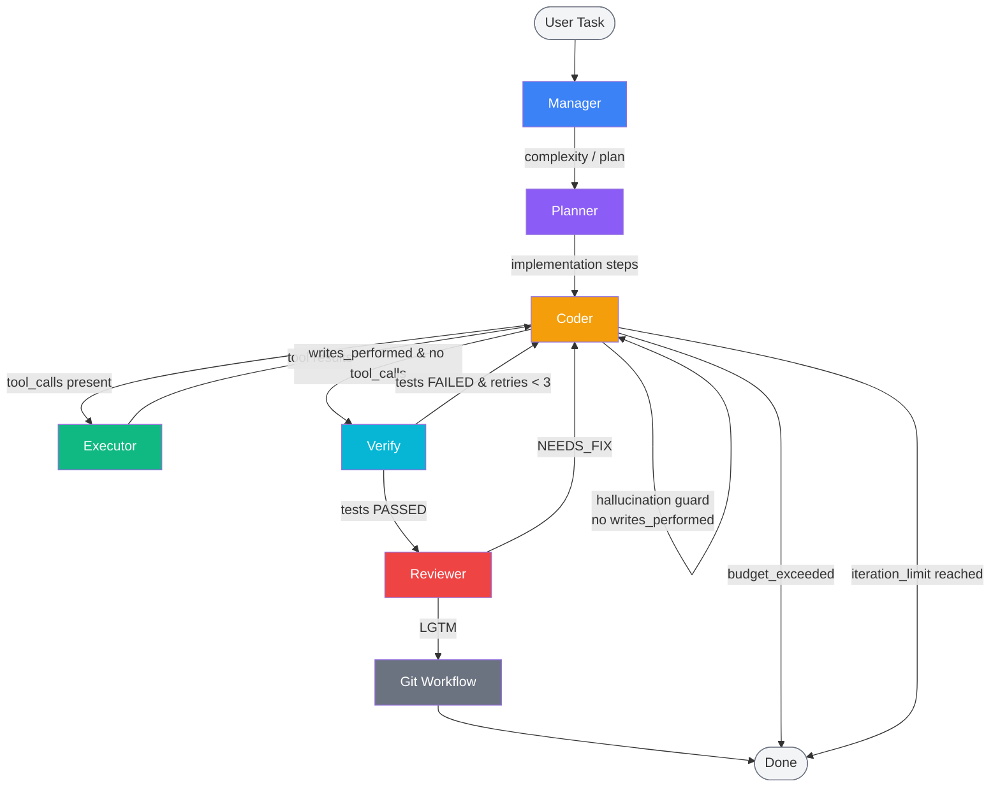
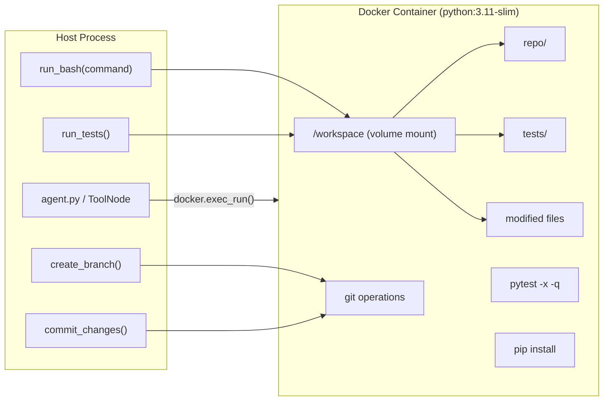
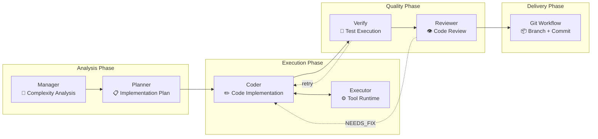
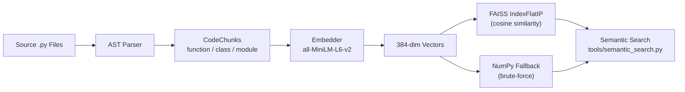
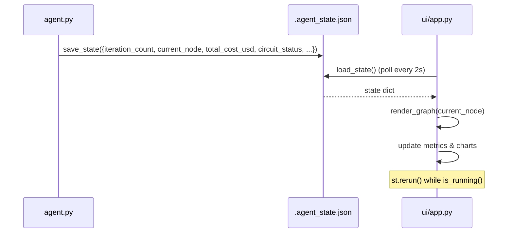

# Auto-SWE-Agent: Multi-Agent Autonomous Software Engineering Framework with Isolated Docker Sandboxing

[](https://www.python.org)
[](https://github.com/langchain-ai/langgraph)
[](https://github.com/BerriAI/litellm)
[](LICENSE)
[](.github/workflows/ci.yml)
[](ui/app.py)
[](https://langfuse.com)
[](https://github.com/facebookresearch/faiss)
[](https://www.docker.com)
[](https://huggingface.co/spaces/YashKasare/auto-swe-agent)

---

**LangGraph state orchestration · LiteLLM multi-provider routing · multi-agent self-correcting lifecycle · AST-hybrid code indexing · FAISS semantic retrieval · Docker-isolated execution sandbox · Langfuse observability**

An **autonomous multi-agent software engineering system** that ingests natural-language issue descriptions, performs contextual codebase exploration, implements fixes through a coordinated agent pipeline, validates correctness via automated test execution inside an isolated Docker container, and persists changes through a structured git workflow — all without human intervention.

Built on **LangGraph** for stateful agent orchestration, **LiteLLM** for dynamic model routing across Gemini and Groq providers, and **sentence-transformers with FAISS** for hybrid semantic code retrieval.

---

## 🎥 Live Demo

Try the Streamlit diagnostic dashboard live on Hugging Face Spaces:

[](https://huggingface.co/spaces/YashKasare/auto-swe-agent)

The dashboard provides real-time visibility into:
- **Agent Graph** — live LangGraph node highlighting as the pipeline executes
- **Cost Analytics** — per-model token spend, budget utilisation gauge, and historical cost trends
- **Circuit Breaker** — per-model health status, failure counts, and recovery state tracking
- **Eval Results** — historical pass/fail rates, iteration distributions, and model usage breakdowns

> **Note**: API keys (GEMINI_API_KEY, GROQ_API_KEY) must be configured as [Space secrets](https://huggingface.co/docs/hub/spaces-secrets) for the agent run functionality to work. The dashboard UI loads in read-only mode without keys.

To deploy your own instance, see the [Deployment Guide](docs/hf_deploy.md).

---

## System Architecture Overview

### Multi-Agent State Flowchart

The orchestrator implements a **human-like division of labor** across four specialized LLM agents coordinated through a LangGraph `StateGraph` state machine. The shared `GraphState` TypedDict (22 fields) propagates messages, execution context, cost tracking, and Langfuse trace identifiers across all nodes.



### Docker Container Mapping

All `run_bash_command`, `run_tests`, and git operations execute inside an isolated `python:3.11-slim` container via the Docker Python SDK (`docker.from_env().containers.run()`), with the workspace directory volume-mounted at `/workspace`.



### Routing Semantics

Each node's successor is determined by pure conditional-routing functions operating on the shared `GraphState`. The graph is compiled via `workflow.compile()` in `agent.py:_build_multi_agent_graph()` at `agent.py:739`.

| Transition | Decision Function | Trigger | Fallback |
|---|---|---|---|
| Manager → | `route_manager()` | `error_logs` empty → planner | `end` on error |
| Planner → | `route_planner()` | `error_logs` empty → coder | `end` on error |
| Coder → | `route_coder()` | `tool_calls` present → executor; writes done → verify | coder (hallucination guard); end (budget/iteration limit) |
| Executor → | edge | tool results → coder | — |
| Verify → | `route_verify()` | tests passed → reviewer; failed & retries < 3 → coder | `end` at max attempts |
| Reviewer → | `route_reviewer()` | `LGTM` → git_workflow; `NEEDS_FIX` → coder | — |
| Git → | `route_git()` | always → `end` | — |

---

## Multi-Agent Architecture Pattern

The graph topology enforces a **separation of concerns** that mirrors human software engineering teams, with each agent operating under a distinct system prompt and tool set:



| Node | File | System Prompt Focus | Tools Available |
|---|---|---|---|
| **Manager** | `agents/manager.py:3` | Complexity classification, iteration limit estimation, high-level plan | None — analysis only |
| **Planner** | `agents/planner.py:3` | Concrete sub-step decomposition with file/function references | None — planning only |
| **Coder** | `agents/coder.py:5` | Code changes via read/write/search/execute/git tools | All 10 tools |
| **Executor** | `agent.py:304` | ToolNode dispatch + Langfuse tracing | All 10 tools |
| **Verify** | `agent.py:354` | `pytest -x -q` inside Docker sandbox | None — pytest only |
| **Reviewer** | `agents/reviewer.py:3` | Patch quality: correctness, completeness, test coverage | None — review only |
| **Git Workflow** | `agent.py:386` | `git checkout -b auto-swe/fix-<ts>` + `git commit` | None — git ops only |

The Coder ↔ Executor loop allows iterative refinement: the Coder issues tool calls, the Executor dispatches them, and results flow back to the Coder for the next decision. After files are written, control escalates to Verify for test-driven validation.

---

## Resilience Layer

The agent is hardened against API provider failures through a three-layer resilience architecture implemented across `resilience/retry.py`, `resilience/circuit_breaker.py`, and `agents/base.py`.

### Dynamic Model Fallback Chain

Defined in `agent.py:197`, the system maintains a prioritized model cascade:

```python
FALLBACK_MODELS = [
    "gemini/gemini-2.0-flash",         # Primary — low latency, high throughput
    "gemini/gemini-2.0-flash-lite",    # Fallback 1 — cost-optimized (50% cheaper)
    "groq/llama-3.3-70b-versatile",    # Fallback 2 — high-quality 70B open model
    "groq/llama3-8b-8192",             # Fallback 3 — maximum availability, 8B efficiency
]
```

Each model is gated by two checks in `agents/base.py:_invoke_agent()` at line 165:
1. **API key presence** (`_model_available()` at line 55) — skips models whose provider credentials are unset
2. **Circuit breaker state** (`circuit_breaker.can_call(model)` at line 170) — skips models in OPEN state

On transient failure (rate limit, 5xx, timeout, connection error), the system escalates to the next available tier with exponential backoff.

### Exponential Backoff Retry (`resilience/retry.py`)

The `with_retry` decorator at `resilience/retry.py:11` provides configurable retry logic:

```python
@with_retry(
    max_retries=3,
    base_delay=2.0,
    max_delay=30.0,
    exponential_base=2.0,
    retryable_exceptions=(Exception,),
)
```

Delay sequence: `base_delay × (exponential_base^attempt)`, capped at `max_delay`. Only retries on exceptions matching `retryable_exceptions` — permanent errors (auth failures, missing API keys) propagate immediately.

### Circuit Breaker Pattern (`resilience/circuit_breaker.py`)

Per-model fault isolation via the `CircuitBreaker` class at `resilience/circuit_breaker.py:8`:

| Parameter | Default | Behavior |
|---|---|---|
| `failure_threshold` | 5 | Consecutive failures before circuit opens |
| `recovery_timeout` | 300s | Cooldown before transitioning to half-open |
| States | CLOSED → OPEN → HALF-OPEN | Standard circuit breaker state machine |

- **CLOSED**: Normal operation; requests pass through
- **OPEN**: Fail-fast; `can_call()` returns `False`, request is logged to `circuit_events`
- **HALF-OPEN**: After `recovery_timeout` seconds, one probe request is allowed; success closes the circuit, failure reopens it

State transitions are captured in `_circuit_events: list[str]` and surfaced in both the CLI summary and the Streamlit dashboard.

### Hallucination Guard

A critical safety mechanism in `route_coder()` at `agent.py:466` prevents premature termination:

```python
if not state.get("writes_performed", False):
    print("[GUARD] No files written yet — forcing back to coder.")
    return "coder"
```

If the model asserts completion without executing a single `write_to_file` call, the router **forces** the workflow back to the Coder node. This guard evaluates `state["writes_performed"]`, a boolean set to `True` only when the Executor processes a `write_to_file` tool invocation.

---

## Hybrid Repository Indexing

The RAG subsystem provides dual-mode code retrieval that combines AST-level structural understanding with dense vector search.

### Indexing Pipeline



### Component Stack

| Component | File | Details |
|---|---|---|
| **AST Parser** | `indexing/parser.py:55` | `stdlib.ast`-based extraction of functions, async functions, and classes. Produces `CodeChunk` dataclasses with `file_path`, `chunk_type`, `name`, `signature`, `docstring`, `start_line`, `end_line`, `body_preview`, and `full_text`. |
| **Embedder** | `indexing/embedder.py:18` | Primary: `sentence-transformers/all-MiniLM-L6-v2` (384-dim). Fallback: bag-of-words TF-IDF via NumPy when sentence-transformers is unavailable. |
| **Vector Store** | `indexing/vector_store.py:20` | Primary: FAISS `IndexFlatIP` (inner product = cosine similarity on L2-normalized vectors). Fallback: brute-force cosine similarity via `np.linalg.norm` + matrix multiply. Persisted as `.faiss` + `.pkl`. |
| **Build CLI** | `indexing/build_index.py:20` | `ensure_index_built()` called at agent startup (`agent.py:828`); staleness detection via file mtime comparison (`check_index_staleness()` at `indexing/parser.py:175`). |

### Search Capabilities

- **Semantic Search** (`tools/semantic_search.py:34`): LangChain `@tool` that embeds the query, searches the FAISS index, and returns top-k `CodeChunk` matches with file path, line number, signature, docstring, and body preview. Usage: `semantic_search("find where user authentication is handled", k=5)`.
- **Keyword Search** (`search_codebase` at `agent.py:144`): O(n) grep across all files, skipping `.venv`, `__pycache__`, `.git`, `node_modules` and other noise directories. Usage: `search_codebase("password", directory="./src")`.

The index is auto-built on first agent run (`agent.py:828`) and rebuilt when source files are newer than the cached index. Typical index size: **< 100 MB** (CPU-buildable, no GPU required).

---

## Docker Runtime Sandbox

All operational commands execute inside a **Docker sandbox** to prevent host contamination and provide reproducible execution environments.

### Sandbox Implementation (`agent.py:78`)

```python
_sandbox = docker_client.containers.run(
    "python:3.11-slim",
    command="sleep infinity",           # Keeps container alive for exec_run
    detach=True,
    remove=True,                         # Auto-cleanup on stop
    labels={"role": _SANDBOX_LABEL},     # Reuse detection label
    volumes={abs_workspace: {"bind": "/workspace", "mode": "rw"}},
    working_dir="/workspace",
)
```

### Security Properties

| Property | Implementation |
|---|---|
| **No host-side execution** | All `run_bash_command`, `run_tests`, and git operations route through `container.exec_run()` |
| **Volume isolation** | Workspace directory mounted read-write at `/workspace`; container has no access to other host paths |
| **Container lifecycle** | Single persistent container reused across invocations — no per-call overhead. Detected by label `role=auto-swe-agent-sandbox` |
| **Dependency isolation** | `pip install` runs inside the container, never affecting the host Python environment |
| **Auto-cleanup** | `remove=True` ensures the container is deleted when stopped |

### Health Check

On first container creation, the sandbox runs:

1. `pip install fastapi httpx pytest uvicorn` inside the container
2. `python -c "import fastapi, pytest, httpx, uvicorn"` to verify runtime health

If either step fails, the agent raises `RuntimeError("[Docker] Health check failed.")`.

---

## Interactive Streamlit Diagnostic UI

The diagnostic dashboard at `ui/app.py` provides five panels with real-time visibility into agent execution.

### Panel Layout

| Panel | Route | Key Features |
|---|---|---|
| **🚀 Run Agent** | Default | Issue text input, model selector, budget slider, workspace path, retry/circuit config, live log streaming with subprocess PIPE |
| **📊 Live Monitor** | Live polling | LangGraph node highlight (`ui/components/agent_graph.py`), color-coded agent badge (Manager=blue, Planner=purple, Coder=amber, Reviewer=red, Executor=green, Verify=cyan, Git=gray), budget gauge, cost pie chart, circuit breaker per-model status, auto-refresh every 2s |
| **📈 Results** | Historical eval | `results_*.json` loader from `eval/`, model/status filters, rolling pass-rate chart, cost-per-run bar chart, iterations-vs-cost scatter plot |
| **💰 Costs** | Cost analysis | Total spend, total tokens, avg cost by pass/fail, most expensive run, budget gauge, per-model cost pie, CSV export |
| **🔧 System Status** | Health dashboard | Circuit breaker state per model, model health (success rate over last 10 runs), retry statistics, Docker sandbox container status via `docker.from_env()` |

### State Propagation

The agent writes a JSON state file after each iteration via `AgentStateManager.save_state()` (`ui/state_manager.py:20`). The Streamlit app polls this file on a 2-second loop for real-time display:



### Cost Tracking (`tracking/cost_tracker.py`)

Per-model pricing from `tracking/cost_tracker.py:19`:

| Model | Input $/1K tokens | Output $/1K tokens |
|---|---|---|
| `gemini-2.0-flash` | $0.000075 | $0.0003 |
| `gemini-2.0-flash-lite` | $0.0000375 | $0.00015 |
| `llama-3.3-70b-versatile` | $0.00059 | $0.00079 |
| `llama3-8b-8192` | $0.00005 | $0.0001 |

Token usage is extracted from `response.usage_metadata` when available; when the API does not return usage metadata, the system falls back to estimation (input = `len(msgs) × 500`, output = `len(str(content)) // 4`) and flags the record as `estimated`.

---

## Quickstart & Configuration

### Prerequisites

- **Python 3.11+**
- **Docker Engine 24+** (or Docker Desktop) — required for sandboxed execution
- **API Key** — at least one of: [Gemini](https://aistudio.google.com/app/apikey) or [Groq](https://console.groq.com/keys)

### Installation

```bash
git clone https://github.com/YashKasare21/auto-swe-agent.git
cd auto-swe-agent
python -m venv venv && source venv/bin/activate
pip install -r requirements.txt
```

For development (linting, type checking, coverage):

```bash
pip install -r requirements-dev.txt
```

### Environment Configuration

```bash
# Required (at least one provider):
export GEMINI_API_KEY="your_gemini_api_key"   # Primary model provider
export GROQ_API_KEY="your_groq_api_key"        # Open-source model provider

# Optional — Langfuse observability (https://langfuse.com):
export LANGFUSE_PUBLIC_KEY="pk-lf-..."
export LANGFUSE_SECRET_KEY="sk-lf-..."
export LANGFUSE_HOST="https://cloud.langfuse.com"
```

### CLI Reference

```bash
# Run on a task (positional argument):
python agent.py "Fix the /add endpoint — it returns string concatenation instead of integer addition" --workspace ./

# Full options:
python agent.py \
  --task "Implement retry logic in network client" \
  --workspace ~/projects/my-repo \
  --budget 3.0 \
  --max-iterations 30 \
  --output-dir ./agent_output \
  --retry-max 3 \
  --retry-delay 2.0 \
  --circuit-threshold 5 \
  --circuit-timeout 300

# Single-agent mode (legacy planner-only for A/B comparison):
python agent.py --single-agent "Fix bug in auth module" --workspace ./

# Help:
python agent.py --help
```

### CLI Flags

| Flag | Default | Description |
|---|---|---|
| `task` (positional) | — | Natural-language issue description |
| `--workspace` | `./` | Target repository path |
| `--budget` | `5.0` | Maximum USD spend (`0` = unlimited) |
| `--max-iterations` | `0` | Max graph iterations (`0` = auto based on complexity) |
| `--single-agent` | `false` | Bypass multi-agent pipeline (legacy mode) |
| `--output-dir` | `null` | Persist `final_answer.txt`, `patch.diff`, `state.json` |
| `--retry-max` | `3` | LLM call retry limit per model |
| `--retry-delay` | `2.0` | Base exponential backoff delay (seconds) |
| `--circuit-threshold` | `5` | Consecutive failures before circuit opens |
| `--circuit-timeout` | `300` | Circuit-breaker recovery cooldown (seconds) |

### Web UI

```bash
streamlit run ui/app.py
```

Opens at `http://localhost:8501` with live agent graph, cost dashboard, circuit-breaker monitoring, and historical eval results.

### Evaluation Suite

```bash
# Golden test cases (custom end-to-end in eval/run_eval.py):
make eval
# or directly:
python eval/run_eval.py

# SWE-bench Lite (first 10 tasks):
make swe-bench
# or:
python -m swe_bench.run_swe_bench --num-tasks 10

# Specific SWE-bench instances:
python -m swe_bench.run_swe_bench \
  --instance-ids django__django-11011 django__django-11039

# Generate markdown report:
python scripts/swe_bench_report.py -o SWE_BENCH_RESULTS.md
```

### Makefile Commands

```bash
make install       # Install runtime dependencies
make install-dev   # Install dev + runtime dependencies
make test          # Run pytest suite (tests/)
make test-coverage # Run tests with coverage report
make lint          # black + isort + mypy checks
make format        # Auto-format with black + isort
make ui            # Launch Streamlit dashboard
make run           # Run agent.py interactively
make swe-bench     # Run SWE-bench Lite (10 tasks)
make eval          # Run golden eval cases
make report        # Generate SWE-bench report
make cost-report   # Generate cost analysis report
make clean         # Remove __pycache__ and .pytest_cache
```

---

## Technology Stack

| Layer | Component | Library | Version |
|---|---|---|---|
| **Orchestration** | State machine | [LangGraph](https://github.com/langchain-ai/langgraph) | 0.2.74 |
| **LLM Gateway** | Multi-provider routing | [LiteLLM](https://github.com/BerriAI/litellm) | 1.67.4 |
| **LLM Interface** | Tool binding | [LangChain Community](https://github.com/langchain-ai/langchain) | 0.3.23 |
| **Embeddings** | Text → Vector | [sentence-transformers](https://github.com/UKPLab/sentence-transformers) | 2.2+ |
| **Vector Search** | ANN index | [FAISS](https://github.com/facebookresearch/faiss) | 1.7+ |
| **Container Runtime** | Process isolation | [Docker SDK](https://docker-py.readthedocs.io/) | 7.1.0 |
| **Web UI** | Real-time dashboard | [Streamlit](https://streamlit.io/) | 1.28+ |
| **Observability** | LLM telemetry | [Langfuse](https://langfuse.com/) | 2.55+ |
| **Testing** | Validation | [pytest](https://pytest.org/) | 8.3.5 |
| **API Server** | Test fixture | [FastAPI](https://fastapi.tiangolo.com/) | 0.115.12 |
| **Code Quality** | Formatting & types | Black, isort, mypy | — |
| **Charting** | Data visualization | [Plotly](https://plotly.com/) | 5.18+ |

---

## Repository Map

```
auto-swe-agent/
├── agent.py                         # LangGraph graph builder, CLI parser, routing logic, Docker sandbox
├── main.py                          # FastAPI test fixture (used by eval cases)
│
├── agents/                          # Multi-agent orchestration
│   ├── __init__.py                  #   Public API exports
│   ├── base.py                      #   AgentRuntime: LLM invocation, fallback, cost tracking, Langfuse spans
│   ├── manager.py                   #   Manager: complexity analysis, iteration limit, high-level plan
│   ├── planner.py                   #   Planner: concrete sub-step decomposition with file/function refs
│   ├── coder.py                     #   Coder: code implementation with 10 bound tools + no-write guard
│   └── reviewer.py                  #   Reviewer: LGTM / NEEDS_FIX quality gate
│
├── indexing/                        # RAG semantic code search
│   ├── parser.py                    #   AST-based CodeChunk extraction (stdlib ast)
│   ├── embedder.py                  #   all-MiniLM-L6-v2 + bag-of-words NumPy fallback
│   ├── vector_store.py              #   FAISS IndexFlatIP + brute-force cosine NumPy fallback
│   └── build_index.py               #   Index builder with staleness checks (mtime comparison)
│
├── tools/                           # LangChain @tool implementations
│   ├── git_tools.py                 #   create_branch, commit_changes, generate_pr_description
│   └── semantic_search.py           #   Semantic code search via FAISS index
│
├── resilience/                      # Fault tolerance layer
│   ├── retry.py                     #   Exponential backoff decorator: with_retry()
│   └── circuit_breaker.py           #   Per-model circuit breaker: CircuitBreaker class
│
├── tracking/
│   └── cost_tracker.py              #   Per-model token accounting, budget enforcement, CostTracker
│
├── observability/                   # Langfuse telemetry
│   ├── langfuse_client.py           #   LangfuseClient with graceful degradation when unconfigured
│   └── tool_tracing.py              #   trace_tool decorator + trace_tool_execution for ToolNode
│
├── eval/
│   └── run_eval.py                  #   Golden test case harness: EvalCase, EvalResult, run_eval()
│
├── swe_bench/                       # SWE-bench Lite evaluation harness
│   ├── harness.py                   #   Dataset loading, workspace setup, patch validation
│   └── run_swe_bench.py             #   CLI entry point
│
├── ui/                              # Streamlit web dashboard
│   ├── app.py                       #   5-panel Streamlit app (Run, Monitor, Results, Costs, Status)
│   ├── state_manager.py             #   AgentStateManager: JSON file-based state persistence
│   └── components/
│       ├── agent_graph.py           #   Multi-agent / single-agent flow visualization (HTML+CSS)
│       └── cost_chart.py            #   Plotly charts: budget_gauge, cost_pie, cost_bar, stacked_bar
│
├── scripts/                         # Utility scripts
│   ├── swe_bench_report.py          #   SWE-bench markdown report generator
│   ├── cost_report.py               #   Cost analysis report
│   ├── launch_ui.py                 #   Streamlit launcher helper
│   └── resilience_report.py         #   Circuit breaker health report
│
├── tests/                           # Pytest unit tests
│   ├── test_main.py                 #   FastAPI /add endpoint tests
│   └── test_password_pdf.py         #   Password-protected PDF extraction tests
│
├── docs/                            # Documentation
├── assets/                          # Architecture diagrams (PNG, SVG)
│
├── Dockerfile                       # Sandbox container: python:3.11-slim + git
├── Makefile                         # Build automation: install, test, lint, format, run, ui, eval
├── requirements.txt                 # Runtime dependencies
├── requirements-dev.txt             # Dev dependencies (black, isort, mypy, pytest-cov)
├── .env.example                     # Langfuse environment variable template
├── .github/workflows/ci.yml         # GitHub Actions CI pipeline
├── CONTRIBUTING.md                  # Contribution guidelines
└── LICENSE                          # MIT license
```

---

## Benchmark Results

| Benchmark | Score | Details |
|---|---|---|
| **Golden Cases** (custom) | **2/2 (100%)** | `add-endpoint-bug` and `docstream-password-pdf` in `eval/run_eval.py` |
| **SWE-bench Lite** | *TBD* | Evaluation-ready harness in `swe_bench/` — 300 tasks across 12 Python repos |

---

## Contributing

See [CONTRIBUTING.md](CONTRIBUTING.md) for development setup, coding standards, and pull request guidelines.

---

## Citation

```bibtex
@software{auto_swe_agent,
  author = {Yash Kasare},
  title = {Auto-SWE-Agent: Multi-Agent Autonomous Software Engineering Framework},
  year = {2025},
  url = {https://github.com/YashKasare21/auto-swe-agent}
}
```

---

## License

MIT — see [LICENSE](LICENSE).
