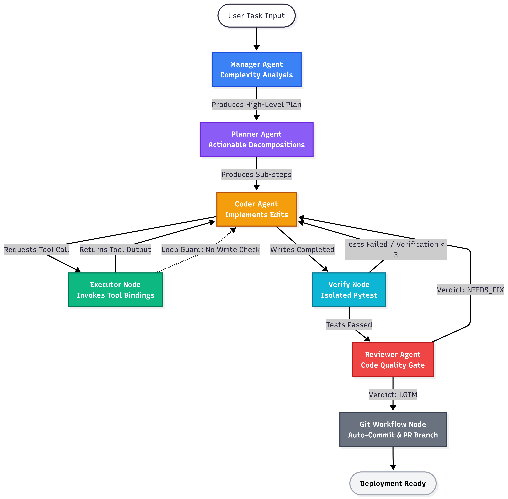
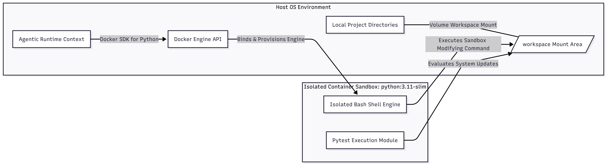

# Auto-SWE-Agent: Multi-Agent Autonomous Software Engineering Framework with Isolated Docker Sandboxing

[](https://www.python.org)
[](https://github.com/langchain-ai/langgraph)
[](LICENSE)
[](https://huggingface.co/datasets/princeton-nlp/SWE-bench_Lite)
[](.github/workflows/ci.yml)
[](ui/app.py)
[](https://langfuse.com)
[](https://github.com/psf/black)

---

An **autonomous multi-agent software engineering system** that ingests natural language issue descriptions, performs contextual codebase exploration, implements fixes through a coordinated agent pipeline, validates correctness via automated test execution within an isolated Docker sandbox, and persists changes through a structured git workflow — all without human intervention.

Built on **LangGraph** for stateful agent orchestration, **LiteLLM** for dynamic model routing, and **sentence-transformers** with FAISS for semantic code retrieval.

---

## Core Architecture Keywords

| Paradigm | Implementation |
|---|---|
| **Agentic Design Patterns** | Specialized agent roles (Manager, Planner, Coder, Reviewer) with distinct system prompts and model tiers |
| **LangGraph Orchestration** | Stateful directed graph with conditional routing, 7-node topology, and typed state propagation |
| **Resilient Multi-Agent Coordination** | Functional routing with circuit breaker, exponential backoff, 4-model fallback chain, and hallucination guards |
| **Sandbox Environments** | Docker SDK volume-mount isolation — all bash, pytest, and git commands execute inside `python:3.11-slim` containers |
| **Vector Semantic Indexing** | AST-parsed code chunking → `all-MiniLM-L6-v2` embeddings → FAISS index with brute-force numpy fallback |
| **Hybrid Search Architecture** | Keyword grep (`search_codebase`) + semantic vector search (`semantic_search`) for comprehensive code retrieval |
| **Observability & Telemetry** | Langfuse tracing with structured spans, LLM generation metadata, routing decision logging, and custom evaluation scoring |
| **Cost Governance** | Per-model token accounting with configurable USD budget thresholds and automated circuit termination |

---

## System Architecture Overview

The orchestration pipeline implements a **human-like division of labor** across four specialized LLM agents coordinated through a LangGraph state machine. Each agent operates with a distinct model tier and system prompt, mirroring the software engineering workflow of analysis → planning → implementation → review.


*Figure 1: LangGraph state machine topology — 7-node multi-agent orchestration pipeline with conditional routing, verification loops, and review-based gates.*

### Pipeline Topology

```
User Task → Manager → Planner → Coder ↔ Executor → Verify → Reviewer → Git Workflow → Done
```

### Agent Roles & Model Allocation

| Node | Model Tier | Responsibility | System Prompt Focus |
|---|---|---|---|
| **Manager** | `flash-lite` | Task complexity analysis; outputs `COMPLEXITY`, `ITERATION_LIMIT`, `PLAN` sections | Structured problem decomposition, resource estimation |
| **Planner** | `flash` | Decomposes plan into concrete, ordered implementation steps | Action sequencing, dependency identification |
| **Coder** | `flash` | Implements code changes using all available tools (read, write, search, execute) | Implementation fidelity, test awareness |
| **Reviewer** | 70B param | Evaluates patch quality; outputs `**LGTM**` or `**NEEDS_FIX**` | Code review standards, correctness verification |

### Routing Semantics

The graph employs **functional conditional routing** — each node's successor is determined by pure functions operating on the shared `GraphState` TypedDict (22 fields including `messages`, `workspace_dir`, `complexity`, `review_feedback`, `iteration_count`, `total_cost_usd`, `langfuse_trace_id`).

| Transition | Condition | Fallback |
|---|---|---|
| Coder → Executor | Message contains tool calls | Route tools to ToolNode |
| Coder → Verify | Writes performed, no pending tool calls | Escalate to test suite |
| Coder → Coder | No writes performed (hallucination guard) | Force file creation |
| Verify → Coder | Tests failed, retries < 3 | Return with error context |
| Verify → Reviewer | Tests passed | Escalate to code review |
| Reviewer → Coder | Output contains `NEEDS_FIX` | Return with review feedback |
| Reviewer → Git Workflow | Output contains `LGTM` | Proceed to persistence |

---

## Production-Grade Resilience Features

### Dynamic Model Fallback Chain

The system maintains a prioritized model cascade that guarantees high availability across API provider failures:

```python
FALLBACK_MODELS = [
    "gemini/gemini-2.0-flash",         # Primary — low latency, high throughput
    "gemini/gemini-2.0-flash-lite",    # Fallback 1 — cost-optimized
    "groq/llama-3.3-70b-versatile",    # Fallback 2 — high-quality open model
    "groq/llama3-8b-8192",             # Fallback 3 — maximum availability
]
```

Each model is gated by API key presence (`_model_available()` checks environment variables) and circuit breaker state before invocation. On transient failure (rate limit, 5xx, timeout), the system automatically escalates to the next available tier with exponential backoff.

### Circuit Breaker Pattern

A custom implementation in `resilience/circuit_breaker.py` provides per-model fault isolation:

| Parameter | Default | Behavior |
|---|---|---|
| `failure_threshold` | 5 | Consecutive failures before circuit opens |
| `recovery_timeout` | 300s | Cooldown window before half-open probe |
| `success_threshold` | 2 | Successful calls needed to close circuit |

The circuit transitions through three states — **CLOSED** (normal operation) → **OPEN** (fail-fast with no-op) → **HALF_OPEN** (probe with single request). State transitions are logged to `circuit_events` and surfaced in the Streamlit dashboard.

### Hallucination Guard

A critical safety mechanism in `route_coder()` prevents premature termination: if the agent asserts completion without executing a single `write_to_file` call, the router **forces** the workflow back to the Coder node. This check evaluates `state["writes_performed"]` — a boolean set to `True` only when the Executor node processes a `write_to_file` tool invocation.

```python
if not state.get("writes_performed", False):
    print("[GUARD] No files written yet — forcing back to coder.")
    return "coder"
```

### Context Windowing & Token Management

To respect model context limits, the system implements a sliding window on message history (last 10 messages) and truncates tool outputs beyond 4000 characters. Token usage is tracked per-call for both input and output, enabling precise cost accounting.

---

## Repository Comprehensive Indexing

The RAG subsystem in `indexing/` provides dual-mode code retrieval:

### Indexing Pipeline

```
Source Files → [AST Parser] → Code Chunks → [Embedder] → Vector Store → [FAISS Index]
                                                                   ↓
                                                          [NumPy Fallback]
```

### Component Stack

| Component | File | Details |
|---|---|---|
| **AST Parser** | `indexing/parser.py` | `stdlib.ast`-based function/class extraction; produces `CodeChunk` dataclasses with signature, docstring, and source context |
| **Embedder** | `indexing/embedder.py` | Primary: `sentence-transformers/all-MiniLM-L6-v2` (384-dim). Fallback: bag-of-words TF-IDF via NumPy |
| **Vector Store** | `indexing/vector_store.py` | Primary: FAISS `IndexFlatL2`. Fallback: brute-force cosine similarity via NumPy |
| **Build CLI** | `indexing/build_index.py` | `ensure_index_built()` called at agent startup; staleness check via file mtime comparison |

### Search Capabilities

- **Semantic Search** (`tools/semantic_search.py`): LangChain `@tool`-decorated function that queries by conceptual meaning — e.g., "authentication flow" returns authentication-related code even without keyword matches.
- **Keyword Search** (`search_codebase`): Regex-based grep across the codebase for exact pattern matching.

Index size for typical repositories: **< 100 MB** (384-dim embeddings, CPU-buildable, no GPU required).

---

## Containerized Execution & Security

All operational commands execute inside a **Docker sandbox** to prevent host contamination:

### Sandbox Architecture


*Figure 2: Docker-based execution isolation — workspace directory volume-mounted into a python:3.11-slim container. All tool execution, test runs, and git operations occur inside the sandbox.*

```
Host Process                          Docker Container (python:3.11-slim)
┌──────────────────┐                 ┌──────────────────────────────────────┐
│  agent.py        │  docker SDK     │  /workspace (volume mount)           │
│  ToolNode        │ ──────────────► │  - my_repo/                          │
│  - run_bash      │    exec_run     │  - tests/                            │
│  - run_tests     │                 │  - modified files                    │
│  - git commands  │                 │                                      │
└──────────────────┘                 │  pytest -x -q                        │
                                     │  git checkout -b auto-swe/fix-...    │
                                     │  pip install [dependencies]          │
                                     └──────────────────────────────────────┘
```

### Security Properties

- **No host-side execution**: `run_bash_command`, `run_tests`, and all git operations route through `docker exec_run()`
- **Volume isolation**: Workspace directory is mounted read-write; the container has no access to other host paths
- **Container lifecycle**: A single persistent container (`python:3.11-slim` with git installed) is created at startup and reused across invocations — no per-call container overhead
- **Dependency isolation**: The agent can `pip install` packages inside the container without affecting the host Python environment

---

## Streamlit Monitoring & Observability Dashboard

The web UI in `ui/app.py` provides real-time diagnostic visibility into agent execution:

### Dashboard Panels

| Panel | Content |
|---|---|
| **Agent Graph** | Live LangGraph visualization (`ui/components/agent_graph.py`) highlighting the active node — 7-node multi-agent or 4-node single-agent layout |
| **Current Agent Badge** | Color-coded indicator (Manager=blue, Planner=purple, Coder=amber, Reviewer=red, Executor=green, Verify=cyan, Git=gray) |
| **Cost Breakdown** | Per-model cumulative spend, token counts, and budget meter with configurable `--budget` threshold |
| **Circuit Status** | Open/closed state per model, circuit event log with timestamps, failure count per model |
| **Metrics** | Iteration count, verification attempts, LGTM/NEEDS_FIX ratio, semantic search call count |
| **Model Distribution** | Pie chart showing call distribution across the fallback chain |

### Langfuse Observability

When configured (`LANGFUSE_PUBLIC_KEY`, `LANGFUSE_SECRET_KEY`, `LANGFUSE_HOST`), the system emits structured telemetry:

| Trace Type | Granularity | Captured Data |
|---|---|---|
| **Agent Spans** | Per invocation | Node name, model, input preview, output status |
| **LLM Generations** | Per call | Model, prompt tokens, completion tokens, latency |
| **Tool Executions** | Per invocation | Tool name, arguments, result status, error messages |
| **Routing Decisions** | Per transition | Source→target, iteration, tests_passed, budget status |
| **Evaluation Scores** | Per run | `tests_passed` (1.0/0.0), `review_quality` (LGTM%), `search_efficiency` |

Trace URLs are printed to stdout at the end of each run for direct navigation:

```
[LANGFUSE] Trace: https://cloud.langfuse.com/trace/abc123...
```

---

## Quickstart & Configuration

### Prerequisites

- **Python 3.11+** — CPython runtime
- **Docker** — Container runtime for sandboxed execution (Docker Engine 24+ or Docker Desktop)
- **API Key** — At least one of: [Gemini](https://aistudio.google.com/app/apikey), [Groq](https://console.groq.com/keys), or [OpenRouter](https://openrouter.ai/keys)

### Installation

```bash
git clone https://github.com/YashKasare21/auto-swe-agent.git
cd auto-swe-agent
python -m venv venv && source venv/bin/activate
pip install -r requirements.txt
```

### Environment Configuration

```bash
# Required (at least one):
export GEMINI_API_KEY="your_key"        # Primary model provider
export GROQ_API_KEY="your_key"           # Open-source model provider

# Optional:
export LANGFUSE_PUBLIC_KEY="pk-lf-..."   # LLM observability
export LANGFUSE_SECRET_KEY="sk-lf-..."   # LLM observability
export LANGFUSE_HOST="https://cloud.langfuse.com"
```

### CLI Reference

```bash
# Run on any task (positional argument):
python agent.py "Fix the /add endpoint — it returns string concatenation instead of integer addition" --workspace ./

# With explicit flags:
python agent.py \
  --task "Implement retry logic in network client" \
  --workspace ~/projects/my-repo \
  --budget 3.0 \
  --max-iterations 30 \
  --output-dir ./agent_output

# Single-agent mode (legacy, for A/B comparison):
python agent.py --single-agent "Fix bug in auth module" --workspace ./

# Full flag listing:
python agent.py --help
```

| Flag | Default | Description |
|---|---|---|
| `task` (positional) | — | Natural language issue description |
| `--workspace` | `./` | Target repository path |
| `--budget` | `5.0` | Maximum USD spend (0 = unlimited) |
| `--max-iterations` | `0` | Maximum graph iterations (0 = auto) |
| `--single-agent` | `false` | Bypass multi-agent pipeline; use legacy planner-only |
| `--output-dir` | `null` | Persist `final_answer.txt`, `patch.diff`, `state.json` |
| `--retry-max` | `3` | LLM call retry limit per model |
| `--retry-delay` | `2.0` | Base exponential backoff delay (seconds) |
| `--circuit-threshold` | `5` | Consecutive failures before circuit opens |
| `--circuit-timeout` | `300` | Circuit breaker recovery cooldown (seconds) |

### Web UI

```bash
streamlit run ui/app.py
```

Opens at `http://localhost:8501` with live agent graph, cost dashboard, and circuit breaker monitoring.

### Evaluation

```bash
# Golden test cases (custom end-to-end):
python eval/run_eval.py

# SWE-bench Lite (first 10 tasks):
python -m swe_bench.run_swe_bench --num-tasks 10

# SWE-bench specific instances:
python -m swe_bench.run_swe_bench \
  --instance-ids django__django-11011 django__django-11039

# Generate markdown report:
python scripts/swe_bench_report.py -o SWE_BENCH_RESULTS.md
```

### Makefile Commands

```bash
make install       # Install runtime dependencies
make install-dev   # Install dev + runtime dependencies
make test          # Run pytest suite
make lint          # black + isort + mypy checks
make format        # Auto-format with black + isort
make ui            # Launch Streamlit dashboard
make swe-bench     # Run SWE-bench Lite (10 tasks)
make eval          # Run golden eval cases
make clean         # Remove __pycache__ and .pytest_cache
```

---

## Benchmark Results

| Benchmark | Score | Context |
|---|---|---|
| **SWE-bench Lite** | *TBD (evaluation ready)* | 300 tasks across 12 Python repos |
| **Golden Cases** | **2/2 (100%)** | Custom end-to-end tests in `eval/run_eval.py` |

---

## Repository Map

```
auto-swe-agent/
├── agent.py                    # Entry point: graph builder, CLI, routing
├── agents/                     # Multi-agent orchestration
│   ├── base.py                 #   AgentRuntime: LLM invocation, fallback, cost tracking
│   ├── manager.py              #   Manager: complexity analysis, structured plan
│   ├── planner.py              #   Planner: implementation sequencing
│   ├── coder.py                #   Coder: code implementation with tool bindings
│   └── reviewer.py             #   Reviewer: LGTM / NEEDS_FIX evaluation
├── indexing/                   # RAG semantic code search
│   ├── parser.py               #   AST-based code chunking (stdlib ast)
│   ├── embedder.py             #   sentence-transformers + TF-IDF fallback
│   ├── vector_store.py         #   FAISS + NumPy brute-force fallback
│   └── build_index.py          #   Index builder with staleness checks
├── tools/                      # Agent tool implementations
│   ├── git_tools.py            #   Branch creation, commit, PR description
│   └── semantic_search.py      #   Semantic code search (@tool)
├── swe_bench/                  # SWE-bench Lite evaluation harness
│   ├── harness.py              #   Dataset loading, workspace setup, evaluation
│   └── run_swe_bench.py        #   CLI entry point
├── observability/              # Langfuse tracing integration
│   ├── langfuse_client.py      #   Client with graceful degradation
│   └── tool_tracing.py         #   Tool execution decorators
├── tracking/
│   └── cost_tracker.py         #   Per-model token accounting, budget enforcement
├── resilience/
│   └── circuit_breaker.py      #   Circuit breaker pattern implementation
├── eval/
│   └── run_eval.py             #   Golden test case harness
├── ui/                         # Streamlit web dashboard
│   ├── app.py                  #   Main application
│   └── components/             #   Graph visualization, cost charts
├── scripts/                    # Utility scripts
├── tests/                      # Pytest unit tests
├── assets/                     # Architecture diagrams, sandbox visualization
├── Dockerfile                  # Sandbox container image
└── Makefile                    # Build automation
```

---

## Technology Stack

| Layer | Component | Library |
|---|---|---|
| **Orchestration** | State machine | [LangGraph](https://github.com/langchain-ai/langgraph) 0.2.74 |
| **LLM Routing** | Multi-provider gateway | [LiteLLM](https://github.com/BerriAI/litellm) 1.67.4 |
| **LLM Interface** | Tool binding | [LangChain](https://github.com/langchain-ai/langchain) |
| **Embeddings** | Text → Vector | [sentence-transformers](https://github.com/UKPLab/sentence-transformers) 2.2+ |
| **Vector Search** | Approximate nearest neighbor | [FAISS](https://github.com/facebookresearch/faiss) 1.7+ |
| **Container Runtime** | Process isolation | [Docker SDK](https://docker-py.readthedocs.io/) 7.1 |
| **Web UI** | Real-time dashboard | [Streamlit](https://streamlit.io/) |
| **Observability** | LLM telemetry | [Langfuse](https://langfuse.com/) |
| **Testing** | Validation | [pytest](https://pytest.org/) 8.3 |
| **Code Quality** | Formatting & types | Black, isort, mypy |

---

## Contributing

See [CONTRIBUTING.md](CONTRIBUTING.md) for development setup, coding standards, and pull request guidelines.

---

## License

MIT — see [LICENSE](LICENSE).

---

## Citation

```bibtex
@software{auto_swe_agent,
  author = {Yash Kasare},
  title = {Auto-SWE-Agent: Multi-Agent Autonomous Software Engineering Framework},
  year = {2025},
  url = {https://github.com/YashKasare21/auto-swe-agent}
}
```
